**# Hi there 👋**

I'm Anuj Raghuwanshi, a Computer Science student interested in

software development, AI/ML, and building things.

---

## 📊 My Contributions

---

## Tech Stack

  
  
  
  
  
  
   

  
  
  
  
  
   

  
  
  
  
  
  

